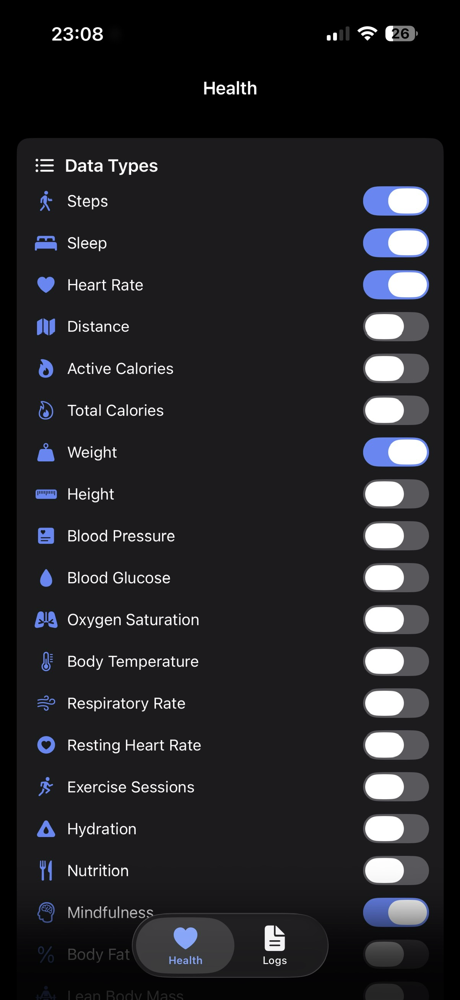
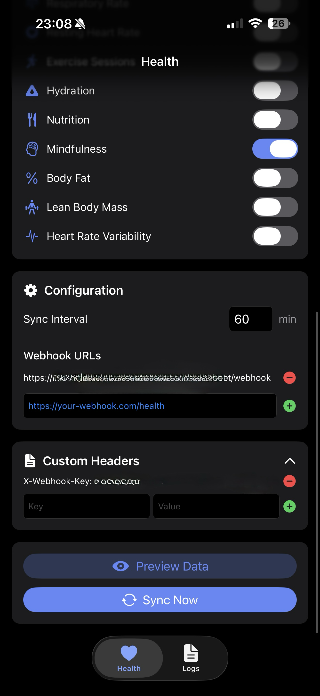
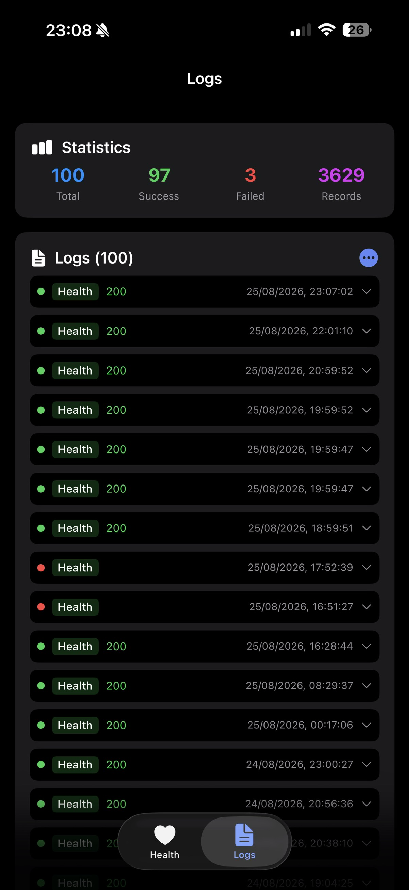

# Life Dashboard Companion (iOS)

[](https://github.com/owen282000/life-dashboard-companion-app-ios/actions/workflows/build.yml)
[](https://github.com/owen282000/life-dashboard-companion-app-ios/actions/workflows/security.yml)
[](https://github.com/owen282000/life-dashboard-companion-app-ios/actions/workflows/codeql.yml)
[](https://opensource.org/licenses/MIT)
[](https://developer.apple.com)

<p align="center">
  
  
  
</p>

A privacy-focused iOS app that syncs your Apple Health (HealthKit) data to your own server via webhooks. Perfect for self-hosted dashboards, Home Assistant integrations, or any quantified self setup.

This is the iOS counterpart of [Life Dashboard Companion for Android](https://github.com/owen282000/life-dashboard-companion-app). Both apps send a compatible JSON payload, so they can feed the same backend.

## Why This App?

- **Own Your Data** - Send health data to your own server, not third-party clouds
- **Flexible Webhooks** - Works with any backend that accepts JSON POST requests
- **22 Health Data Types** - Supports all major HealthKit data types
- **Real Background Sync** - HealthKit wakes the app when new data arrives, no polling needed
- **Modern UI** - Built with SwiftUI

## Features

### HealthKit Integration

- Syncs data from Apple Health to your webhook
- **22 supported data types**:
  - **Activity**: Steps, Distance, Active Calories, Total Calories, Exercise Sessions
  - **Body**: Weight, Height, Body Temperature
  - **Body Composition**: Body Fat %, Lean Body Mass
  - **Vitals**: Heart Rate, Resting Heart Rate, Heart Rate Variability (HRV), Blood Pressure, Blood Glucose, Oxygen Saturation, Respiratory Rate
  - **Sleep**: Sleep sessions with stages (light, deep, REM, awake)
  - **Nutrition**: Hydration, Nutrition records (calories, protein, carbs, fat)
  - **Mindfulness**: Meditation sessions (from apps that write mindful minutes to Apple Health)
  - **Cycle Tracking**: Menstruation Flow (logged data from cycle apps that write to Apple Health)
- Per-data-type toggle and permission management
- Configurable sync interval (minimum 15 minutes)

### No Screen Time?

The Android companion app also syncs Screen Time, but iOS has no equivalent: Apple's Screen Time APIs (DeviceActivity) are restricted to on-device reports and do not allow exporting usage data, so a webhook sync is not possible.

### Background Sync

Three complementary mechanisms keep your data flowing without opening the app:

1. **HealthKit observers (primary)** - `HKObserverQuery` with background delivery: HealthKit wakes the app the moment new samples arrive, and an incremental anchor-based sync sends only the new records
2. **App refresh task** - runs roughly hourly for a quick incremental catch-up
3. **Processing task** - a full sync of the last 7 days when the device is idle and charging

### Webhook Configuration

- **Multiple webhook URLs** - Send to multiple endpoints simultaneously; a sync counts as delivered when at least one endpoint accepted it
- **Custom headers** - Add auth tokens, API keys, or any custom HTTP headers
- **HMAC payload signing** - Optional `X-Signature` header so your server can verify the sender
- **Retries with backoff** - Transient failures are retried automatically; permanent errors fail fast
- **Offline queue** - Failed payloads are stored on-device and re-sent automatically when connectivity returns or on the next background task

### Data Tools

- **Data preview** - View the exact JSON payload before syncing
- **Export as CSV/JSON** - Export sync logs via the iOS share sheet
- **Webhook logs** - View recent sync attempts with payloads for debugging

## Requirements

- iOS 17.0+
- iPhone with Apple Health
- Xcode 15+ (to build from source)

## Installation

### Build from Source

```bash
# Clone the repository
git clone https://github.com/owen282000/life-dashboard-companion-app-ios.git
cd life-dashboard-companion-app-ios

# Open in Xcode
open LifeDashboardCompanion.xcodeproj
```

In Xcode:

1. Select your own development team under **Signing & Capabilities**
2. Build and run on your iPhone (HealthKit does not work in the simulator with real data)

To run the unit tests:

```bash
xcodebuild test -project LifeDashboardCompanion.xcodeproj -scheme LifeDashboardCompanion \
  -destination 'platform=iOS Simulator,name=iPhone 16 Pro'
```

Contributors who push version tags should enable the repo's git hooks once (validates semver tags against the project version):

```bash
git config core.hooksPath .githooks
```

## Setup

1. Install the app on your iPhone
2. **Grant HealthKit permissions** - Tap "Grant" and select the data types you want to sync
3. **Configure webhook URLs** - Enter your server endpoint(s)
4. **Add webhook headers** (optional) - Configure auth tokens or API keys
5. **Set an HMAC signing secret** (optional, under Custom Headers) - Adds an `X-Signature` header to every request
6. **Set the sync interval** - Minimum 15 minutes
7. Tap **Preview Data** to inspect the payload, then **Sync Now** to send

## Webhook Payload Format

Every payload has these top-level fields:

```json
{
  "timestamp": "2026-02-05T12:00:00Z",
  "app_version": "1.0.0",
  "source": "healthkit_ios",
  "steps": [],
  "sleep": [],
  "heart_rate": [],
  "distance": [],
  "active_calories": [],
  "total_calories": [],
  "weight": [],
  "height": [],
  "blood_pressure": [],
  "blood_glucose": [],
  "oxygen_saturation": [],
  "body_temperature": [],
  "respiratory_rate": [],
  "resting_heart_rate": [],
  "exercise": [],
  "hydration": [],
  "nutrition": [],
  "mindfulness": [],
  "body_fat": [],
  "lean_body_mass": [],
  "heart_rate_variability": [],
  "menstruation_flow": []
}
```

Only enabled data types with records are included. Every record additionally contains a `uuid` (the stable HealthKit sample identifier, useful for server-side deduplication since full syncs re-send the last 7 days) and a `source` (the name of the app or device that wrote the record). These are omitted from the examples below for brevity. Each array contains records with the following fields:

### Activity

**Steps**

```json
{ "count": 1234, "start_time": "2026-02-05T08:00:00Z", "end_time": "2026-02-05T09:00:00Z" }
```

**Distance**

```json
{ "meters": 1523.5, "start_time": "2026-02-05T08:00:00Z", "end_time": "2026-02-05T09:00:00Z" }
```

**Active Calories**

```json
{ "calories": 245.3, "start_time": "2026-02-05T08:00:00Z", "end_time": "2026-02-05T09:00:00Z" }
```

**Total Calories** (active + basal energy records)

```json
{ "calories": 1850.0, "start_time": "2026-02-05T08:00:00Z", "end_time": "2026-02-05T09:00:00Z" }
```

**Exercise Sessions**

```json
{ "type": "running", "start_time": "2026-02-05T07:00:00Z", "end_time": "2026-02-05T08:00:00Z", "duration_seconds": 3600 }
```

### Body

**Weight**

```json
{ "kilograms": 75.5, "time": "2026-02-05T07:00:00Z" }
```

**Height**

```json
{ "meters": 1.82, "time": "2026-02-05T07:00:00Z" }
```

**Body Temperature**

```json
{ "celsius": 36.6, "time": "2026-02-05T07:00:00Z" }
```

### Body Composition

**Body Fat %**

```json
{ "percentage": 18.5, "time": "2026-02-05T07:00:00Z" }
```

**Lean Body Mass**

```json
{ "kilograms": 61.5, "time": "2026-02-05T07:00:00Z" }
```

### Vitals

**Heart Rate**

```json
{ "bpm": 72, "time": "2026-02-05T10:30:00Z" }
```

**Resting Heart Rate**

```json
{ "bpm": 58, "time": "2026-02-05T07:00:00Z" }
```

**Heart Rate Variability (HRV, SDNN)**

```json
{ "heart_rate_variability_millis": 42.5, "time": "2026-02-05T07:00:00Z" }
```

**Blood Pressure** (`diastolic` is omitted when no matching sample exists)

```json
{ "systolic": 120.0, "diastolic": 80.0, "time": "2026-02-05T07:00:00Z" }
```

**Blood Glucose**

```json
{ "mmol_per_liter": 5.5, "time": "2026-02-05T07:00:00Z" }
```

**Oxygen Saturation**

```json
{ "percentage": 98.0, "time": "2026-02-05T07:00:00Z" }
```

**Respiratory Rate**

```json
{ "rate": 16.0, "time": "2026-02-05T07:00:00Z" }
```

### Sleep

**Sleep Sessions** (samples are grouped into sessions; a gap of more than 1 hour starts a new session)

```json
{
  "session_end_time": "2026-02-05T07:30:00Z",
  "duration_seconds": 28800,
  "stages": [
    {
      "stage": "deep",
      "start_time": "2026-02-04T23:00:00Z",
      "end_time": "2026-02-05T01:00:00Z",
      "duration_seconds": 7200
    }
  ]
}
```

Possible stage values: `in_bed`, `sleeping`, `light`, `deep`, `rem`, `awake`, `unknown`. These match the Android companion app's stage naming.

### Nutrition

**Hydration**

```json
{ "liters": 0.5, "start_time": "2026-02-05T08:00:00Z", "end_time": "2026-02-05T08:00:00Z" }
```

**Nutrition**

```json
{ "calories": 450.0, "protein_grams": 25.0, "carbs_grams": 60.0, "fat_grams": 12.0, "start_time": "2026-02-05T12:00:00Z", "end_time": "2026-02-05T12:30:00Z" }
```

All nutrition fields (`calories`, `protein_grams`, `carbs_grams`, `fat_grams`) are optional and omitted when not available.

### Mindfulness

**Mindfulness Sessions**

```json
{ "start_time": "2026-02-05T06:00:00Z", "end_time": "2026-02-05T06:15:00Z", "duration_seconds": 900 }
```

### Cycle Tracking

**Menstruation Flow**

```json
{ "flow": "medium", "time": "2026-02-03T00:00:00Z" }
```

The `flow` field is one of `light`, `medium`, `heavy`, or `unknown`.

## Delivery, Retries and Signing

Every configured webhook URL receives each payload. A sync counts as delivered when at least one endpoint accepted it; per-URL results are visible in the in-app webhook logs.

Failed posts are retried up to 3 times per URL with exponential backoff (1s, 2s), but only for transient failures: network errors, timeouts, HTTP 408, 429, and 5xx. Permanent client errors (401, 404, ...) fail immediately without retrying. If all attempts fail, the payload is queued on-device and re-sent automatically when connectivity returns or on the next background task, so no data is lost while your server is down.

When an HMAC signing secret is configured (under Custom Headers in the app), every POST includes:

```
X-Signature: sha256=<hex of HMAC-SHA256(secret, raw request body)>
```

Verify it server-side by recomputing the HMAC over the raw body:

```javascript
const crypto = require('crypto');

function verifySignature(req, secret) {
  const expected = 'sha256=' + crypto
    .createHmac('sha256', secret)
    .update(req.rawBody) // the exact raw request body bytes
    .digest('hex');
  const actual = req.get('X-Signature') || '';
  return actual.length === expected.length &&
    crypto.timingSafeEqual(Buffer.from(actual), Buffer.from(expected));
}
```

This is the same signing scheme as the Android companion app, so one server-side check covers both.

## Example Backend Integrations

### Simple Express.js Server

```javascript
const express = require('express');
const app = express();
app.use(express.json());

app.post('/api/healthkit', (req, res) => {
  console.log('Health data received:', req.body);
  // Store in database, forward to InfluxDB, etc.
  res.status(200).send('OK');
});

app.listen(3000);
```

### Home Assistant Webhook

Use Home Assistant's webhook trigger to receive data and store it or trigger automations.

## Tech Stack

- **Swift + SwiftUI** - Modern iOS development
- **HealthKit** - Official Apple Health API, with anchored queries and background delivery
- **BackgroundTasks** - `BGAppRefreshTask` and `BGProcessingTask` for scheduled syncs
- **URLSession** - HTTP client with retry logic
- **Network framework** - Connectivity monitoring for the offline queue

## Privacy

This app:

- **Does not collect any data** itself
- **Does not send data anywhere** except your configured webhook URLs
- **Does not include any analytics** or tracking
- **Stores settings locally** on your device only

You are in full control of where your data goes.

## Contributing

Contributions are welcome! Please feel free to submit a Pull Request.

1. Fork the repository
2. Create your feature branch (`git checkout -b feature/amazing-feature`)
3. Commit your changes (`git commit -m 'Add amazing feature'`)
4. Push to the branch (`git push origin feature/amazing-feature`)
5. Open a Pull Request

## License

This project is licensed under the MIT License - see the [LICENSE](LICENSE) file for details.

## Support

If you find this project useful, please consider:

- Starring the repository
- Sharing it with others who might benefit
- Contributing improvements

---

**Made by Owen Vogelaar for the self-hosted and quantified self community.**
