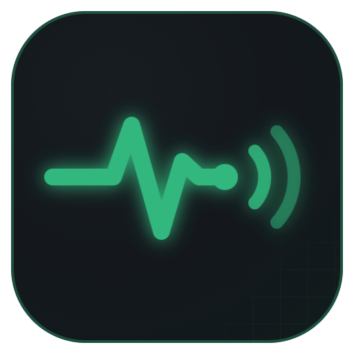
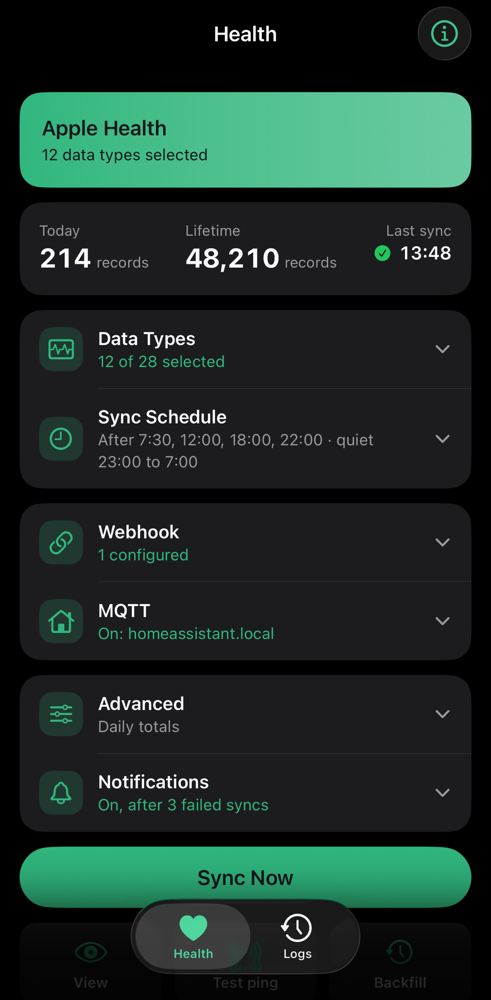
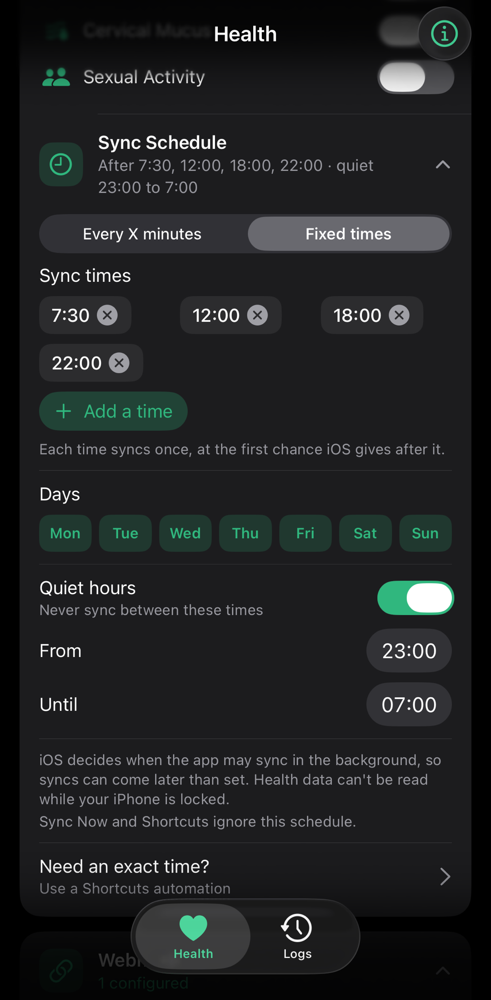
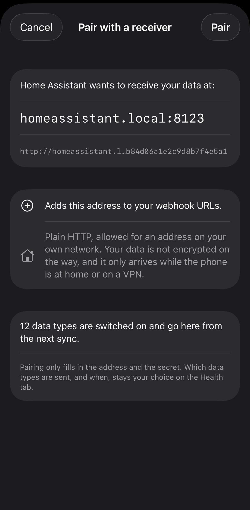

<p align="center">
  
</p>

<h1 align="center">Life Dashboard Companion for iOS</h1>

<h3 align="center">Your health data, your server, no cloud</h3>

<p align="center">
  <a href="https://github.com/owen282000/life-dashboard-companion-app-ios/actions/workflows/build.yml"></a>
  <a href="https://github.com/owen282000/life-dashboard-companion-app-ios/actions/workflows/security.yml"></a>
  <a href="https://github.com/owen282000/life-dashboard-companion-app-ios/actions/workflows/codeql.yml"></a>
  <br>
  <a href="https://scorecard.dev/viewer/?uri=github.com/owen282000/life-dashboard-companion-app-ios"></a>
  <a href="https://opensource.org/licenses/MIT"></a>
  <a href="https://developer.apple.com/ios/"></a>
</p>

<p align="center">
  <a href="#quick-start"><b>Build from source</b></a>
  &nbsp;·&nbsp;
  <a href="docs/usage.md">Setup guide</a>
  &nbsp;·&nbsp;
  <a href="docs/webhook.md">Payload reference</a>
  &nbsp;·&nbsp;
  <a href="https://github.com/owen282000/life-dashboard-companion-app">Android version</a>
</p>

There is no App Store or TestFlight build. You build the app yourself with Xcode and install it on your own iPhone; [Quick start](#quick-start) says how, and what a free Apple Account means for it. It follows the [Android app](https://github.com/owen282000/life-dashboard-companion-app), which gets new features first, and says so where iOS cannot do what Android does.

| Apple Health | Sync schedule | Home Assistant | Delivery logs |
|:--:|:--:|:--:|:--:|
|  |  |  |  |
| 28 data types, per-type toggles, incremental sync | An interval, or earliest times, with quiet hours | Paired with the integration by QR code | Every delivery logged, with a sync history |

## Why this app?

- **Own your data** - health data goes to your own server, not a third-party cloud
- **Flexible delivery** - Home Assistant through the Life Dashboard integration or MQTT Discovery, or any backend that accepts a JSON POST
- **One backend for both phones** - the Android app's payload keys and units, so an iPhone and an Android phone feed the same server or the same integration
- **28 health data types** - every Apple Health type with a counterpart in the Android app, each off until you switch it on
- **History** - a backfill of the last 30, 90 or 365 days, deletions passed on, and day totals that count an iPhone and a Watch once
- **Modern UI** - SwiftUI in the Android app's look, with dark mode, in English, Dutch and German

Also on Android? [Life Dashboard Companion](https://github.com/owen282000/life-dashboard-companion-app) does the same from Health Connect, plus Screen Time per app and writing measurements from Home Assistant into Health Connect. [What iOS does differently](docs/features.md#what-ios-does-differently) lists what an iPhone cannot do, and what this app does not do.

## Quick start

1. Open the project in Xcode 26 or newer, set your own team, bundle identifiers and app group, and run it on your iPhone ([how](docs/usage.md#build-and-install))
2. Switch on the data types you want and grant Apple Health access
3. Scan the Life Dashboard integration's pairing code in Home Assistant ([how](docs/usage.md#with-the-integration)), or enter your webhook URL or MQTT broker
4. Tap **View** to inspect the last 7 days, then **Sync Now** to send what is new

With a free Apple Account the app has to be run from Xcode again every 7 days. The full walkthrough, requirements and troubleshooting are in [docs/usage.md](docs/usage.md).

## Home Assistant

Two ways in, and neither needs YAML.

**The Life Dashboard integration** (0.7.1 or newer) receives the app's webhook directly, so no
broker is needed at all. Pairing is a QR code the integration shows: tap **Scan a pairing code**
on the Health tab, check what the sheet says will change, and tap **Pair**. The address and the
signing secret fill themselves in, and one test ping says whether Home Assistant confirmed it.
It is also the way that keeps history: every day the app sends lands in Home Assistant's
long-term statistics on its own date, so a backfill shows up as months of steps, sleep and heart
rate per day. An Android phone and an iPhone can be paired side by side, each as a device of its
own. What an iPhone does not get there: screen time, and measurements written back to the phone.

[](https://my.home-assistant.io/redirect/hacs_repository/?owner=owen282000&repository=life-dashboard-ha&category=integration)

**MQTT** is the other way, for a setup that already runs a broker. Point the app at the MQTT
broker Home Assistant uses, and MQTT Discovery creates one device with a sensor for 20 of the
28 types, blood pressure as two. Steps, distance and calories are today's totals, as on Android;
the other sensors hold the latest record. Workouts, meals, mindfulness and cycle tracking are
events rather than values and stay webhook-only. States are retained, and
the app uses its own device and base topic (`lifedashboard-ios`), so an iPhone and an Android
phone on one broker stay apart; two iPhones each get a phone name, as Android phones do. A
broker alone is enough: every sync publishes, the automatic ones included, and a broker added
later starts syncing without reopening the app.

The step-by-step setup for both is in [docs/usage.md](docs/usage.md#phone-to-home-assistant); [docs/features.md](docs/features.md#home-assistant-and-mqtt) lists every sensor.

## What it sends

```json
{
  "timestamp": "2026-02-05T12:00:00Z",
  "app_version": "1.3.0",
  "source": "healthkit_ios",
  "steps": [
    {
      "count": 1234,
      "start_time": "2026-02-05T08:00:00Z",
      "end_time": "2026-02-05T09:00:00Z",
      "uuid": "5B7A0C2E-8F3D-4B1A-9C6E-2D4F8A1B3C5D",
      "source": "Owen's iPhone"
    }
  ],
  "daily_totals": [
    { "date": "2026-02-05", "steps": 8421, "distance_meters": 6210.4 }
  ]
}
```

The payload is the Android app's: the same keys, fields, units and signing. Every record carries the HealthKit `uuid` for deduplication and a `source`, the name of the app or device that wrote it. Use `daily_totals` for day totals, the raw records for detail. [docs/webhook.md](docs/webhook.md) lists what an iPhone sends and where it differs from Android; the Android app's [webhook.md](https://github.com/owen282000/life-dashboard-companion-app/blob/main/docs/webhook.md) documents every type, and its [webhook-schema.json](https://github.com/owen282000/life-dashboard-companion-app/blob/main/docs/webhook-schema.json) is the JSON Schema for both apps.

## Documentation

| Doc | Covers |
|---|---|
| [docs/features.md](docs/features.md) | Full feature list, supported data types, MQTT, scheduling, automation, what iOS does differently, tech stack |
| [docs/usage.md](docs/usage.md) | Requirements, building and installing, setup, Home Assistant, troubleshooting |
| [docs/webhook.md](docs/webhook.md) | What an iPhone sends, where it differs from Android, delivery, retries and HMAC signing |
| [docs/settings-backup.md](docs/settings-backup.md) | Exporting and importing your configuration, between iPhones and Android phones |
| [docs/building.md](docs/building.md) | Build, tests, project layout, releasing, screenshots and brand images |
| [docs/localization.md](docs/localization.md) | How the English, Dutch and German texts are kept complete |
| [CHANGELOG.md](CHANGELOG.md) | Release history |
| [Android docs](https://github.com/owen282000/life-dashboard-companion-app#documentation) | The full payload reference, the JSON Schema, and the source app notes |

## Privacy

Life Dashboard Companion is a self-hosting tool. It reads health data on your iPhone and sends it only to servers you set up yourself. The developer never receives, stores or sees any of your data. The same policy is in the app, under About, and on [a page of its own](https://owen282000.github.io/life-dashboard-companion/ios/privacy/), the address App Store Connect links to.

- **What the app reads** - Apple Health data, only for the types you switch on and only after you allow them in the Health access sheet. With Backfill, also older records for the range you pick. When you delete a record in Apple Health, the next sync reports its id so your server can remove it too. The camera is used only by the pairing scanner, while that screen is open: frames are decoded on the phone and are never stored or sent.
- **What the app writes** - nothing. The app only asks Apple Health for read access.
- **Where it goes** - only to the destinations you enter or pair: your own webhook URLs, the Life Dashboard integration in your own Home Assistant, and your own MQTT broker. The app contacts no other server. There are no analytics, no crash reporting services and no advertising SDKs. Besides the types you switch on, each payload carries the app version, and each record the name of the app or device that wrote it, which on an iPhone often includes your name. MQTT is unencrypted unless you switch on TLS. States are published retained, so the broker keeps the latest value of each sensor even after you switch MQTT off in the app: clear the topics on the broker if you stop using it.
- **What stays on the iPhone** - your settings, with secrets in the iOS Keychain. Sync progress, so a sync sends only what is new since the last one; a backfill, or a delivery that iOS cut off, can send a record again with the same `uuid`. A log of the last 100 deliveries, which you can clear, payloads that could not be delivered yet, at most 700, until they arrive or a server has turned them down for a week, and with MQTT on, the latest value of each sensor, so every publish can send them all; switching MQTT off removes them at the next sync. Your settings and the sync progress are part of your iPhone backup, like other app data. The log, the undelivered payloads and the sensor values are not: they stay on this iPhone, and a restored or new iPhone starts without them. Deleting the app removes all of it, but iOS can keep the secrets in the Keychain: clear them in the app first if you want them gone. Exports are files you create yourself and hand to the share sheet or the Files app, where the app you pick keeps its own copy. A settings export without secrets still contains your webhook URLs, which can work as a password, so share it with care.
- **Your control** - everything is opt-in and reversible: which types are read, where they go and how often. Turning off access in the Health app stops the matching reads immediately.
- **Contact** - questions about privacy: open an issue on GitHub or email the developer at the address on the GitHub profile.

The app ships a privacy manifest (`PrivacyInfo.xcprivacy`) that declares no tracking and no collected data.

## Contributing

Contributions are welcome. See [CONTRIBUTING.md](CONTRIBUTING.md) for guidelines and [docs/building.md](docs/building.md) for the build and project layout.

## License

MIT - see [LICENSE](LICENSE).

## Acknowledgments

Built on the work of others:

- [HealthKit](https://developer.apple.com/documentation/healthkit) by Apple, the framework this app reads from, and Apple's SwiftUI, BackgroundTasks, Network, WidgetKit and App Intents frameworks; the app has no third-party dependencies
- The [Android app](https://github.com/owen282000/life-dashboard-companion-app), whose payload, schedule format and settings backup this app follows
- The quantified self and self-hosting communities
- [Claude Code](https://claude.com/claude-code) for assistance with development

## Getting help

[docs/usage.md](docs/usage.md#troubleshooting) covers setup and the questions that come up most. Questions go to the Android app's [Discussions](https://github.com/owen282000/life-dashboard-companion-app/discussions), which cover both apps; say that it is about the iPhone. [SUPPORT.md](.github/SUPPORT.md) explains when something belongs in an issue here instead.

## Sponsoring

If you find this project useful, consider starring the repository, sharing it, or contributing improvements. [Buying me a coffee on Ko-fi](https://ko-fi.com/owen282000) helps keep releases and bug hunts quick - the app stays free and open source either way.

---

<p align="center">
  Made by <a href="https://github.com/owen282000">Owen Vogelaar</a> for the self-hosted and quantified self community.
</p>
