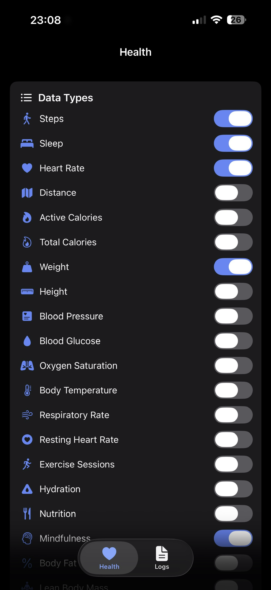
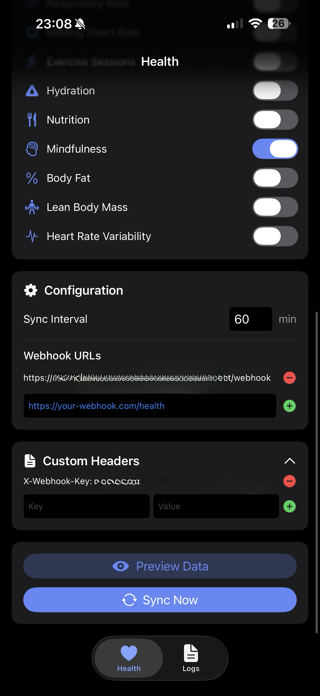
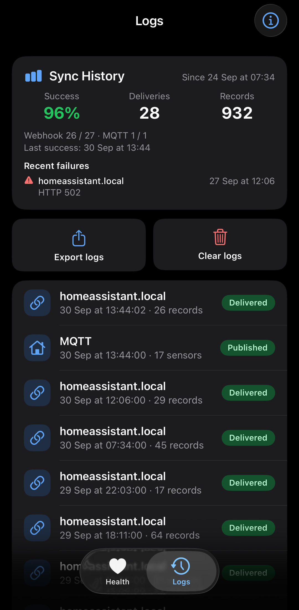

# Life Dashboard Companion (iOS)

[](https://github.com/owen282000/life-dashboard-companion-app-ios/actions/workflows/build.yml)
[](https://github.com/owen282000/life-dashboard-companion-app-ios/actions/workflows/security.yml)
[](https://github.com/owen282000/life-dashboard-companion-app-ios/actions/workflows/codeql.yml)
[](https://scorecard.dev/viewer/?uri=github.com/owen282000/life-dashboard-companion-app-ios)
[](https://opensource.org/licenses/MIT)
[](https://developer.apple.com)

<p align="center">
  
  
  
</p>

A privacy-focused iOS app that syncs your Apple Health (HealthKit) data to your own server via webhooks. Perfect for self-hosted dashboards, Home Assistant integrations, or any quantified self setup.

This is the iOS counterpart of [Life Dashboard Companion for Android](https://github.com/owen282000/life-dashboard-companion-app). Both apps send a compatible JSON payload, so they can feed the same backend.

Looking for an open source alternative to Health Auto Export? This app covers the same HealthKit-to-webhook use case, fully open and self-hosted.

## Why This App?

- **Own Your Data** - Send health data to your own server, not third-party clouds
- **Flexible Webhooks** - Works with any backend that accepts JSON POST requests
- **28 Health Data Types** - Every HealthKit type that has a counterpart in the Android app
- **Real Background Sync** - HealthKit wakes the app when new data arrives, no polling needed
- **Modern UI** - Built with SwiftUI

## Features

### HealthKit Integration

- Syncs data from Apple Health to your webhook
- **28 supported data types**:
  - **Activity**: Steps, Distance, Active Calories, Total Calories, Exercise Sessions
  - **Body**: Weight, Height, Body Temperature, Basal Body Temperature
  - **Body Composition**: Body Fat %, Lean Body Mass
  - **Vitals**: Heart Rate, Resting Heart Rate, Heart Rate Variability (HRV), Blood Pressure, Blood Glucose, Oxygen Saturation, Respiratory Rate, VO2 Max
  - **Sleep**: Sleep sessions with stages (light, deep, REM, awake)
  - **Nutrition**: Hydration, Nutrition records (calories, protein, carbs, fat)
  - **Mindfulness**: Meditation sessions (from apps that write mindful minutes to Apple Health)
  - **Cycle Tracking**: Menstruation Flow, plus Menstruation Periods derived from consecutive flow days, Intermenstrual Bleeding, Ovulation Test, Cervical Mucus, Sexual Activity, Basal Body Temperature (logged data from cycle apps that write to Apple Health)
- Per-data-type toggle and permission management: every type is off until you switch it on, and iOS asks for each one the first time
- Configurable sync interval (minimum 15 minutes)
- **Bounded payloads** - High-volume types are capped per sync (1000 records for heart rate and steps, 500 for HRV and respiratory rate, 200 for the rest), oldest first, so later syncs catch up without skipping records
- **Fault isolation** - A read failure in one data type skips only that type instead of failing the whole sync
- **Deleted records** - A record deleted in Apple Health is named in `deleted_records`, in the same shape as the Android app, so a receiver can drop it (see [Deletions](#deletions))
- **Daily totals** - Per-day steps, distance and calories as the Health app counts them, with overlapping iPhone and Watch data counted once, in the same `daily_totals` format as the Android app (can be switched off)

### Types the Android app sends and iOS cannot

The payload uses the Android app's keys and fields, so one backend serves both. The 28 types cover 29 of the Android app's 33 (menstruation sends flow and periods); four stay out because Apple Health has nothing that means the same:

| Android type | Why iOS does not send it |
|---|---|
| Bone Mass | Apple Health has no bone mass type |
| Body Water Mass | Apple Health has no body water type |
| Skin Temperature | Apple Health stores the absolute sleeping wrist temperature, not the change against a baseline that `delta_celsius` carries |
| Basal Metabolic Rate | Apple Health stores resting energy burned per interval, not a rate in kcal per day; it goes out as part of Total Calories |

HealthKit records no sensation for cervical mucus, so `sensation` is always `unknown`, the value the Android app sends when none was logged.

### No Screen Time?

The Android companion app also syncs Screen Time, but iOS has no equivalent: Apple's Screen Time APIs (DeviceActivity) are restricted to on-device reports and do not allow exporting usage data, so a webhook sync is not possible.

### Background Sync

Three complementary mechanisms keep your data flowing without opening the app:

1. **HealthKit observers (primary)** - `HKObserverQuery` with background delivery: HealthKit wakes the app the moment new samples arrive, and an incremental anchor-based sync sends only the new records
2. **App refresh task** - runs roughly hourly for a quick incremental catch-up
3. **Processing task** - a full sync of the last 7 days when the device is idle and charging

### Webhook Configuration

- **Multiple webhook URLs** - Send to multiple endpoints simultaneously; a sync counts as delivered when at least one endpoint accepted it
- **Custom headers** - Add auth tokens, API keys, or any custom HTTP headers
- **HMAC payload signing** - Optional `X-Signature` header so your server can verify the sender
- **Retries with backoff** - Transient failures are retried automatically; permanent errors fail fast
- **Offline queue** - Failed payloads are stored on-device and re-sent automatically when connectivity returns or on the next background task

### Home Assistant / MQTT
- **MQTT publishing with Home Assistant Discovery** - Point the app at your MQTT broker and the latest value of every synced measurement appears in Home Assistant automatically as sensors, grouped under one device. No server-side configuration needed.
- Exercise, nutrition, mindfulness and cycle tracking are event-like and stay webhook-only, as in the Android app
- Implemented with an in-process MQTT 3.1.1 client over Network.framework, so the app stays free of third-party dependencies
- States and discovery configs are published retained; optional TLS and username/password (stored in the Keychain)
- Uses its own device id and default base topic (`lifedashboard-ios`), so it never collides with the Android app's sensors in mixed households

### Automation

- **Shortcuts & Siri** - A "Sync Health Data" action for the Shortcuts app: automate syncs on a schedule, on arriving home, or by voice
- **Home screen widget** - Last sync result, records delivered today, and a green/red status dot, so silent background failures are visible at a glance

### Data Tools

- **Data preview** - View the exact JSON payload before syncing
- **Test ping** - Send a small test payload to verify your server setup without waiting for real data
- **Export as CSV/JSON** - Export sync logs via the iOS share sheet
- **Webhook logs** - View recent sync attempts with payloads for debugging

## Requirements

- iOS 17.0+
- iPhone with Apple Health
- Xcode 15+ (to build from source)

## Installation

### Build from Source

```bash
# Clone the repository
git clone https://github.com/owen282000/life-dashboard-companion-app-ios.git
cd life-dashboard-companion-app-ios

# Open in Xcode
open LifeDashboardCompanion.xcodeproj
```

In Xcode:

1. Select your own development team under **Signing & Capabilities**
2. Build and run on your iPhone (HealthKit does not work in the simulator with real data)

To run the unit tests:

```bash
xcodebuild test -project LifeDashboardCompanion.xcodeproj -scheme LifeDashboardCompanion \
  -destination 'platform=iOS Simulator,name=iPhone 16 Pro'
```

Contributors who push version tags should enable the repo's git hooks once (validates semver tags against the project version):

```bash
git config core.hooksPath .githooks
```

## Setup

1. Install the app on your iPhone
2. **Choose data types** - Switch on the types you want to sync; iOS asks for permission for each one the first time
3. **Configure webhook URLs** - Enter your server endpoint(s)
4. **Add webhook headers** (optional) - Configure auth tokens or API keys
5. **Set an HMAC signing secret** (optional, under Custom Headers) - Adds an `X-Signature` header to every request
6. **Set the sync interval** - Minimum 15 minutes
7. Tap **Preview Data** to inspect the payload, then **Sync Now** to send

## Webhook Payload Format

Every payload has these top-level fields:

```json
{
  "timestamp": "2026-02-05T12:00:00Z",
  "app_version": "1.0.0",
  "source": "healthkit_ios",
  "daily_totals": [],
  "steps": [],
  "sleep": [],
  "heart_rate": [],
  "distance": [],
  "active_calories": [],
  "total_calories": [],
  "weight": [],
  "height": [],
  "blood_pressure": [],
  "blood_glucose": [],
  "oxygen_saturation": [],
  "body_temperature": [],
  "respiratory_rate": [],
  "resting_heart_rate": [],
  "exercise": [],
  "hydration": [],
  "nutrition": [],
  "mindfulness": [],
  "body_fat": [],
  "lean_body_mass": [],
  "heart_rate_variability": [],
  "vo2_max": [],
  "menstruation_flow": [],
  "menstruation_period": [],
  "basal_body_temperature": [],
  "intermenstrual_bleeding": [],
  "ovulation_test": [],
  "cervical_mucus": [],
  "sexual_activity": []
}
```

Only enabled data types with records are included. Every record additionally contains a `uuid` (the stable HealthKit sample identifier, useful for server-side deduplication since full syncs re-send the last 7 days; an edited record arrives under a new `uuid`, and the old one is named in `deleted_records`) and a `source` (the name of the app or device that wrote the record). These are omitted from the examples below for brevity. Each array contains records with the following fields:

### Activity

**Steps**

```json
{ "count": 1234, "start_time": "2026-02-05T08:00:00Z", "end_time": "2026-02-05T09:00:00Z" }
```

**Distance**

```json
{ "meters": 1523.5, "start_time": "2026-02-05T08:00:00Z", "end_time": "2026-02-05T09:00:00Z" }
```

**Active Calories**

```json
{ "calories": 245.3, "start_time": "2026-02-05T08:00:00Z", "end_time": "2026-02-05T09:00:00Z" }
```

**Total Calories** (active + basal energy records)

```json
{ "calories": 1850.0, "start_time": "2026-02-05T08:00:00Z", "end_time": "2026-02-05T09:00:00Z" }
```

**Exercise Sessions**

```json
{ "type": "running", "start_time": "2026-02-05T07:00:00Z", "end_time": "2026-02-05T08:00:00Z", "duration_seconds": 3600 }
```

### Body

**Weight**

```json
{ "kilograms": 75.5, "time": "2026-02-05T07:00:00Z" }
```

**Height**

```json
{ "meters": 1.82, "time": "2026-02-05T07:00:00Z" }
```

**Body Temperature**

```json
{ "celsius": 36.6, "time": "2026-02-05T07:00:00Z" }
```

### Body Composition

**Body Fat %**

```json
{ "percentage": 18.5, "time": "2026-02-05T07:00:00Z" }
```

**Lean Body Mass**

```json
{ "kilograms": 61.5, "time": "2026-02-05T07:00:00Z" }
```

### Vitals

**Heart Rate**

```json
{ "bpm": 72, "time": "2026-02-05T10:30:00Z" }
```

**Resting Heart Rate**

```json
{ "bpm": 58, "time": "2026-02-05T07:00:00Z" }
```

**Heart Rate Variability (HRV, SDNN)**

```json
{ "heart_rate_variability_millis": 42.5, "time": "2026-02-05T07:00:00Z" }
```

**Blood Pressure** (`diastolic` is omitted when no matching sample exists)

```json
{ "systolic": 120.0, "diastolic": 80.0, "time": "2026-02-05T07:00:00Z" }
```

**Blood Glucose**

```json
{ "mmol_per_liter": 5.5, "time": "2026-02-05T07:00:00Z" }
```

**Oxygen Saturation**

```json
{ "percentage": 98.0, "time": "2026-02-05T07:00:00Z" }
```

**Respiratory Rate**

```json
{ "rate": 16.0, "time": "2026-02-05T07:00:00Z" }
```

**VO2 Max**

```json
{ "vo2_ml_per_min_per_kg": 42.5, "time": "2026-02-05T09:00:00Z" }
```

### Sleep

**Sleep Sessions** (samples are grouped into sessions; a gap of more than 1 hour starts a new session)

```json
{
  "session_end_time": "2026-02-05T07:30:00Z",
  "duration_seconds": 28800,
  "stages": [
    {
      "stage": "deep",
      "start_time": "2026-02-04T23:00:00Z",
      "end_time": "2026-02-05T01:00:00Z",
      "duration_seconds": 7200
    }
  ]
}
```

Possible stage values: `in_bed`, `sleeping`, `light`, `deep`, `rem`, `awake`, `unknown`. These match the Android companion app's stage naming. Sessions are built from the stage samples on every read and carry no `uuid` of their own; each stage carries its sample's `uuid` and `source`.

### Nutrition

**Hydration**

```json
{ "liters": 0.5, "start_time": "2026-02-05T08:00:00Z", "end_time": "2026-02-05T08:00:00Z" }
```

**Nutrition**

```json
{ "calories": 450.0, "protein_grams": 25.0, "carbs_grams": 60.0, "fat_grams": 12.0, "start_time": "2026-02-05T12:00:00Z", "end_time": "2026-02-05T12:30:00Z" }
```

All nutrition fields (`calories`, `protein_grams`, `carbs_grams`, `fat_grams`) are optional and omitted when not available.

### Mindfulness

**Mindfulness Sessions**

```json
{ "start_time": "2026-02-05T06:00:00Z", "end_time": "2026-02-05T06:15:00Z", "duration_seconds": 900 }
```

### Cycle Tracking

**Menstruation Flow**

```json
{ "flow": "medium", "time": "2026-02-03T00:00:00Z" }
```

The `flow` field is one of `light`, `medium`, `heavy`, or `unknown`.

**Menstruation Period**

```json
{ "start_time": "2026-02-01T00:00:00Z", "end_time": "2026-02-05T00:00:00Z" }
```

HealthKit has no period record type, so periods are derived from consecutive flow days (a gap of up to 48 hours tolerates one missed logging day). These records carry no `uuid` or `source`.

**Intermenstrual Bleeding**

```json
{ "time": "2026-02-10T00:00:00Z" }
```

**Ovulation Test**

```json
{ "result": "positive", "time": "2026-02-12T08:00:00Z" }
```

The `result` field is one of `positive` (LH surge), `high` (estrogen surge), `negative`, `inconclusive`, or `unknown`.

**Cervical Mucus**

```json
{ "appearance": "egg_white", "sensation": "unknown", "time": "2026-02-12T08:00:00Z" }
```

The `appearance` field is one of `dry`, `sticky`, `creamy`, `watery`, `egg_white`, or `unknown`. HealthKit records no sensation, so `sensation` is always `unknown`.

**Sexual Activity**

```json
{ "protection_used": "protected", "time": "2026-02-11T00:00:00Z" }
```

The `protection_used` field is `protected` or `unprotected` when the writing app recorded it, and `unknown` otherwise.

**Basal Body Temperature**

```json
{ "celsius": 36.4, "time": "2026-02-12T06:30:00Z" }
```

### Deletions

A record deleted in Apple Health leaves nothing for a sync to read, so a receiver that stores records would keep it. HealthKit never changes a record in place either: an app that edits one deletes it and saves a new one under a new `uuid`, so every edit would leave the old record on the receiver next to the new one. The app follows HealthKit's own record of deletions and names the records that are gone, in the same shape as the Android app:

```json
"deleted_records": [
  { "type": "nutrition", "uuid": "84E37E8A-1C2D-4E5F-8A9B-0C1D2E3F4A5B" }
]
```

`type` is the key the record arrived under and `uuid` is the `uuid` it was delivered with, so drop that `uuid` from that collection. The field is absent when nothing was deleted, and a payload never names a `uuid` it also carries as a record. When a deletion is the only change, the sync sends a payload with `deleted_records` and no record arrays, logged as a delivery of 0 records. Deletions are kept on the phone until a payload carrying them was delivered or queued for retry, so a receiver can get one twice but never lose one.

Types whose deletions a payload cannot vouch for are named in `deletions_unavailable`, a list of payload keys: when HealthKit did not answer in time (five seconds per type, twenty in total, eight in the background), when a type could not be read, and when a type was last read more than 7 days ago. HealthKit may forget a deletion after a while and does not say when, so the 7 days is an estimate, not a HealthKit signal. Reconcile those types against a fresh read of the range instead of trusting the incremental payload.

```json
"deletions_unavailable": ["heart_rate"]
```

Where this differs from the Android app:

- Heart rate and every other sample have their own `uuid`; match it exactly. Android's `<uuid>#<epoch millis>` rule for heart rate samples does not apply.
- An active energy sample is part of both `active_calories` and `total_calories`, so its deletion is named under both when both are enabled.
- A blood pressure reading is named by its systolic sample and a meal by its energy sample. A diastolic value, or protein, carbs or fat inside a meal, deleted on their own are not reported. A protein record that was sent on its own is.
- A sleep deletion names the stage (`stages[].uuid`), because sessions have no `uuid`. Drop that stage, or replace the sessions a newer payload covers; do not drop the whole night.
- `menstruation_period` is derived from flow days and never appears in `deleted_records`; replace the periods a payload covers.
- Tracking starts with the first sync of a type after installing or updating the app, so deletions from before that are not reported. The same holds after a reinstall or a restore onto another iPhone; after a restore the enabled types are named once in `deletions_unavailable`.
- A deletion and the record that replaced it usually arrive together, but a type with more new records than one sync sends can deliver the replacement a sync or two later.
- iOS payloads carry no `sequence`.

### Daily Totals

When an iPhone and a Watch both record steps, Apple Health holds each stretch twice, and adding up the raw records counts it twice. Every payload therefore also carries `daily_totals`, computed with HealthKit's statistics queries, which count overlapping samples from different sources once by the order set in the Health app (Browse, a data type, Data Sources & Access). The figures match what the Health app shows.

```json
"daily_totals": [
  { "date": "2026-02-05", "steps": 8421, "distance_meters": 6210.4, "active_calories": 412.0, "total_calories": 2231.5 }
]
```

The array has the same schema as the Android app's: one entry per local day in the phone's time zone, for today and the two days before, only for enabled types. A field is left out for a day without data rather than sent as 0, and a day without any field is left out. Where it differs from Android:

- `distance_meters` is walking and running distance, the samples the Distance type reads; Health Connect's distance covers every activity
- `total_calories` is resting plus active energy, since HealthKit has no total energy type, and is only sent on days with resting energy. An iPhone without an Apple Watch usually records none, so it is usually absent there

Use `daily_totals` for day totals and the raw records for detail. The setting **Daily totals in payload** switches it off.

## Delivery, Retries and Signing

Every configured webhook URL receives each payload. A sync counts as delivered when at least one endpoint accepted it; per-URL results are visible in the in-app webhook logs.

Failed posts are retried up to 3 times per URL with exponential backoff (1s, 2s), but only for transient failures: network errors, timeouts, HTTP 408, 429, and 5xx. Permanent client errors (401, 404, ...) fail immediately without retrying. If all attempts fail, the payload is queued on-device and re-sent automatically when connectivity returns or on the next background task, so no data is lost while your server is down.

When an HMAC signing secret is configured (under Custom Headers in the app), every POST includes:

```
X-Signature: sha256=<hex of HMAC-SHA256(secret, raw request body)>
```

Verify it server-side by recomputing the HMAC over the raw body:

```javascript
const crypto = require('crypto');

function verifySignature(req, secret) {
  const expected = 'sha256=' + crypto
    .createHmac('sha256', secret)
    .update(req.rawBody) // the exact raw request body bytes
    .digest('hex');
  const actual = req.get('X-Signature') || '';
  return actual.length === expected.length &&
    crypto.timingSafeEqual(Buffer.from(actual), Buffer.from(expected));
}
```

This is the same signing scheme as the Android companion app, so one server-side check covers both.

## Example Backend Integrations

### Simple Express.js Server

```javascript
const express = require('express');
const app = express();
app.use(express.json());

app.post('/api/healthkit', (req, res) => {
  console.log('Health data received:', req.body);
  // Store in database, forward to InfluxDB, etc.
  res.status(200).send('OK');
});

app.listen(3000);
```

### Home Assistant Webhook

Use Home Assistant's webhook trigger to receive data and store it or trigger automations.

## Tech Stack

- **Swift + SwiftUI** - Modern iOS development
- **HealthKit** - Official Apple Health API, with anchored queries and background delivery
- **BackgroundTasks** - `BGAppRefreshTask` and `BGProcessingTask` for scheduled syncs
- **URLSession** - HTTP client with retry logic
- **Network framework** - Connectivity monitoring for the offline queue

## Privacy

This app:

- **Does not collect any data** itself
- **Does not send data anywhere** except your configured webhook URLs
- **Does not include any analytics** or tracking
- **Stores settings locally** on your device only
- **Reads only what you switch on** - Every data type starts off and asks for its own permission; cycle tracking and sexual activity never go to MQTT
- **Keeps secrets in the iOS Keychain** - Webhook headers and the HMAC signing secret are stored in the Keychain, not in plaintext preferences
- **Protects logs at rest** - Webhook logs (which contain payload snapshots) are stored with iOS file protection and capped in size
- **Ships a privacy manifest** (`PrivacyInfo.xcprivacy`): no tracking, no collected data types

You are in full control of where your data goes.

## Contributing

Contributions are welcome! Please feel free to submit a Pull Request.

1. Fork the repository
2. Create your feature branch (`git checkout -b feature/amazing-feature`)
3. Commit your changes (`git commit -m 'Add amazing feature'`)
4. Push to the branch (`git push origin feature/amazing-feature`)
5. Open a Pull Request

## License

This project is licensed under the MIT License - see the [LICENSE](LICENSE) file for details.

## Support

If you find this project useful, please consider:

- Starring the repository
- Sharing it with others who might benefit
- Contributing improvements

P.S. The About screen hides a couple of easter eggs.

---

**Made by Owen Vogelaar for the self-hosted and quantified self community.**
