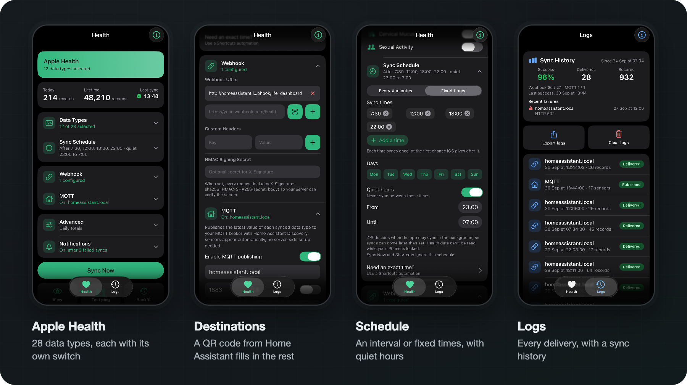
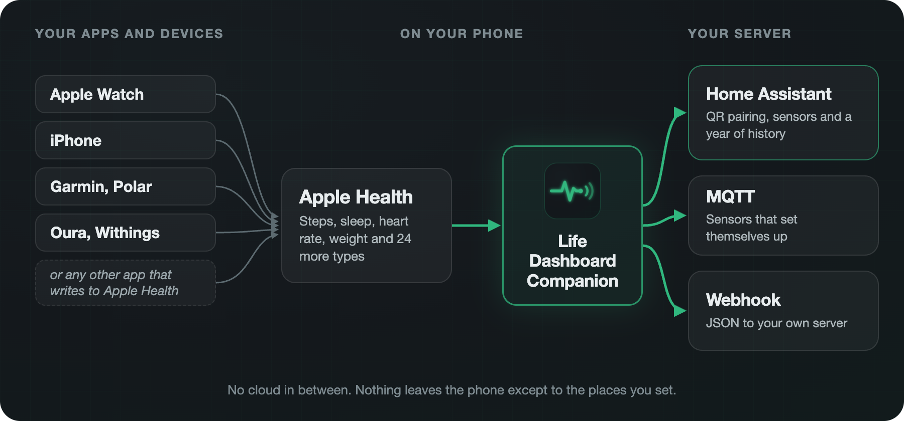

<p align="center">
  
</p>

<h1 align="center">Life Dashboard Companion for iOS</h1>

<p align="center">
  <b>Apple Health from your iPhone, sent to Home Assistant, MQTT or your own server.</b><br>
  No cloud in between, no account, no tracking.
</p>

<p align="center">
  <a href="#build-and-install"></a>
  <a href="https://my.home-assistant.io/redirect/hacs_repository/?owner=owen282000&repository=life-dashboard-ha&category=integration"></a>
  <a href="#build-and-install"></a>
  <a href="https://scorecard.dev/viewer/?uri=github.com/owen282000/life-dashboard-companion-app-ios"></a>
  <a href="LICENSE"></a>
</p>

<p align="center">
  <a href="#build-and-install"><b>Build&nbsp;and&nbsp;install</b></a>
  &nbsp;·&nbsp;
  <a href="docs/usage.md">Setup&nbsp;guide</a>
  &nbsp;·&nbsp;
  <a href="docs/webhook.md">Payload&nbsp;reference</a>
</p>

<p align="center">
  <picture>
    <source media="(max-width: 600px)" srcset="docs/readme-screens-phone.png">
    
  </picture>
</p>

Your Apple Watch, iPhone, ring or scale already writes to Apple Health. This app reads it and sends it to a server you run. In Home Assistant you get sensors for today and a year of history in long-term statistics. Over MQTT, sensors set themselves up. A webhook gets every record as JSON, signed if you set a secret.

It sends the same payload as the [Android app](https://github.com/owen282000/life-dashboard-companion-app), so an iPhone and an Android phone can feed one backend or one Home Assistant. There's no App Store or TestFlight build yet: you build it with Xcode and install it on your own iPhone.

<a id="why-this-app"></a>

## What you get

- **28 Apple Health types.** Steps, sleep with stages, heart rate and HRV, weight and body composition, blood pressure, glucose, workouts, nutrition, VO2 max, cycle tracking and more. Each one is off until you switch it on.
- **Every record, plus clean daily totals.** Every record goes out with the app or device that wrote it. Daily totals for steps, distance and calories come from Apple Health's own statistics, so a walk recorded by both iPhone and Watch counts once.
- **A year of history.** Backfill 30, 90 or 365 days. In Home Assistant each day lands on its own date. When you delete a record in Apple Health, the next sync tells your server.
- **Runs in the background.** An interval or fixed times, on the days you pick, with quiet hours. iOS decides the exact moment. For an exact time, a Shortcuts automation runs **Sync Health Data**. Payloads that can't be delivered wait on the iPhone for the next sync.
- **Widget, Control Center and Shortcuts.** See the last sync on your home screen, and sync from there, from Control Center (iOS 18 or newer) or with Siri.
- **English, Dutch and German.** The Android app's look, with Dynamic Type and dark mode.

## How it works

Apple Health is where your iPhone, Apple Watch and apps like Garmin Connect, Oura and Withings keep their data. This app reads from it in the background and sends the new records straight to the places you set up.

<p align="center">
  <picture>
    <source media="(max-width: 600px)" srcset="docs/how-it-works-phone.png">
    
  </picture>
</p>

Two things from the Android app aren't here. There's no screen time, because iOS shows Screen Time data only inside a sandbox that can't send anything out. And the app doesn't write readings back into Apple Health. [What iOS does differently](docs/features.md#what-ios-does-differently) lists every difference and why.

## Part of Life Dashboard

Life Dashboard is four projects, and you only install the parts you need. Put the app on each phone, then choose where the data goes. Both apps send the same payload, so an Android phone and an iPhone can share one Home Assistant or one stack.

<table>
<thead>
<tr>
<th align="left" width="50%">On your phone</th>
<th align="left" width="50%">Where the data goes</th>
</tr>
</thead>
<tbody>
<tr>
<td valign="top">
<a href="https://github.com/owen282000/life-dashboard-companion-app">Android app</a><br>
<sub>Health Connect and screen time</sub><br><br>
<b>iPhone app</b><br>
<sub>Apple Health</sub>
</td>
<td valign="top">
<a href="https://github.com/owen282000/life-dashboard-ha">Home Assistant integration</a><br>
<sub>Sensors and a year of history</sub><br><br>
<a href="https://github.com/owen282000/life-dashboard-stack">Grafana stack</a><br>
<sub>Postgres and Grafana dashboards</sub><br><br>
An MQTT broker or a webhook of your own<br>
<sub>Built into both apps, for n8n, Node-RED or a script</sub>
</td>
</tr>
</tbody>
</table>

<a id="quick-start"></a>

## Build and install

You need a Mac with Xcode 26 (the newest Xcode needs macOS 26.2; on macOS 15.6, Xcode 26.3 works), an iPhone on iOS 17 or newer, and an Apple Account. A free account works, but then the app stops opening after 7 days until you run it from Xcode again. A paid developer account signs it for a year.

1. Clone the repository, open `LifeDashboardCompanion.xcodeproj`, and set your own team, bundle identifiers and app group. The [setup guide](docs/usage.md#build-and-install) shows where each one goes.
2. Run it on your iPhone. The first time, iOS asks you to switch on Developer Mode and trust your certificate.
3. In Home Assistant (2026.3 or newer, with [HACS](https://hacs.xyz/docs/use/) installed), add the [Life Dashboard integration](https://my.home-assistant.io/redirect/hacs_repository/?owner=owen282000&repository=life-dashboard-ha&category=integration) as a custom repository, download it, restart, and add the integration. It shows a QR code. Skip this step if you use MQTT or a webhook.
4. The app's setup asks where your data should go: scan the code, or enter your broker or webhook URL. Then pick your data types and allow Apple Health access.
5. Tap **Sync Now**. Tap **View** first if you want to preview the payload.

To update, pull the repository and run it from Xcode again. Your settings stay. The [setup guide](docs/usage.md) covers every step and what to do when nothing arrives.

## Home Assistant

There are two ways in. Neither needs YAML.

| | Life Dashboard integration | MQTT |
|---|---|---|
| Setup | HACS, then scan a QR code | Enter your broker |
| Sensors | 20 of 28 types, blood pressure as two | The same |
| History | Every day, up to a year back, through backfill | From the first sync on |
| Workouts and mindfulness | Minutes per day | No |
| An Android phone too | Its own device next to it | Its own device and base topic |
| Example dashboard | Included, without its screen time cards | No |

Pick the integration unless you already run a broker and don't need the days before your first sync. Single meals, cycle tracking entries and workout details are events rather than values, so neither route turns them into sensors. A webhook of your own gets them in full. [Setup for both](docs/usage.md#phone-to-home-assistant) is in the guide, and [features.md](docs/features.md#home-assistant-and-mqtt) lists the MQTT sensors.

[](https://my.home-assistant.io/redirect/hacs_repository/?owner=owen282000&repository=life-dashboard-ha&category=integration)

<details>
<summary><b>Already use the Home Assistant companion app?</b></summary>

<br>

Keep it. It does presence, notifications and device sensors, and this app doesn't try to. They work side by side.

The companion app reads Apple Health too. Its Apple Health sensors ([#5272](https://github.com/home-assistant/iOS/pull/5272), [#5638](https://github.com/home-assistant/iOS/pull/5638)) cover steps, heart rate, weight, blood pressure, sleep stages and more, each as one sensor with today's total or the newest reading. Their history in Home Assistant starts the day you switch them on, and workout details, meals and cycle tracking aren't among them.

This app covers the health side in depth: 28 types, every record with the app or device that wrote it, up to a year of backfilled history with each day on its own date, and MQTT or a webhook when Home Assistant isn't the only place it should go.

</details>

<a id="what-it-sends"></a>

## Webhooks

Any server that accepts a JSON POST can be a destination: n8n, Node-RED, a small script, or your own API. Payloads are signed with HMAC-SHA256 if you set a secret, and you can add custom headers or a client certificate.

```json
{
  "timestamp": "2026-10-04T12:00:00Z",
  "app_version": "1.6.0",
  "source": "healthkit_ios",
  "sequence": 1842,
  "daily_totals": [
    {
      "date": "2026-10-04",
      "steps": 8421,
      "distance_meters": 6210.4
    }
  ],
  "steps": [
    {
      "count": 1234,
      "start_time": "2026-10-04T08:00:00Z",
      "end_time": "2026-10-04T09:00:00Z",
      "uuid": "5B7A0C2E-8F3D-4B1A-9C6E-2D4F8A1B3C5D",
      "source": "Alex's Apple Watch"
    }
  ]
}
```

This example is shortened. The keys, units and signing are the Android app's. Every raw record has a `uuid` to deduplicate on and a `source`, the name of the app or device that wrote it. [webhook.md](docs/webhook.md) lists what an iPhone sends and where it differs from Android. The Android app's [payload reference](https://github.com/owen282000/life-dashboard-companion-app/blob/main/docs/webhook.md) documents every type and has receivers to start from, and its [JSON Schema](https://github.com/owen282000/life-dashboard-companion-app/blob/main/docs/webhook-schema.json) covers both apps.

If you have no backend yet, [life-dashboard-stack](https://github.com/owen282000/life-dashboard-stack) is an example Docker Compose setup: a receiver that checks the signature, Postgres, and a Grafana dashboard. Treat it as a starting point rather than a finished product.

## Privacy

The app has no analytics, no crash reporting and no ads, and there's no Life Dashboard server. Your data goes from the iPhone to the destinations you set and nowhere else. Webhooks use HTTPS. iOS allows plain HTTP only to an IP address, a .local name or a name without a dot, meant for your own network. The app only asks Apple Health for read access, and secrets stay in the iOS Keychain. [PRIVACY.md](PRIVACY.md) lists everything the app reads, sends and keeps.

## Documentation

**Get started:** [Setup guide](docs/usage.md) · [Troubleshooting](docs/usage.md#troubleshooting)

**Reference:** [All features](docs/features.md) · [What iOS does differently](docs/features.md#what-ios-does-differently) · [Payload](docs/webhook.md) · [Settings backup](docs/settings-backup.md)

**Project:** [Building and releasing](docs/building.md) · [Translations](docs/localization.md) · [Contributing](CONTRIBUTING.md) · [Changelog](CHANGELOG.md) · [Privacy](PRIVACY.md) · [Security](SECURITY.md)

**From the Android app:** [Full payload reference](https://github.com/owen282000/life-dashboard-companion-app/blob/main/docs/webhook.md) · [JSON Schema](https://github.com/owen282000/life-dashboard-companion-app/blob/main/docs/webhook-schema.json) · [Ask your own LLM about your history](https://github.com/owen282000/life-dashboard-companion-app/blob/main/docs/recipes/ask-your-own-llm.md)

## Help and contributing

Questions go to the Android app's [Discussions](https://github.com/owen282000/life-dashboard-companion-app/discussions), which cover both apps; say that it's about the iPhone. Bugs go to [issues](https://github.com/owen282000/life-dashboard-companion-app-ios/issues/new/choose) here. [SUPPORT.md](.github/SUPPORT.md) explains which is which.

Pull requests are welcome. [CONTRIBUTING.md](CONTRIBUTING.md) covers the checks CI runs, and [building.md](docs/building.md) gets you a working build.

## Acknowledgments

- [HealthKit](https://developer.apple.com/documentation/healthkit) by Apple, which this app reads from, and Apple's SwiftUI, BackgroundTasks, Network, WidgetKit and App Intents frameworks. The app has no third-party dependencies.
- The [Android app](https://github.com/owen282000/life-dashboard-companion-app), whose payload, schedule format and settings backup this app follows
- The quantified self and self-hosting communities
- [Claude Code](https://claude.com/claude-code), which drafted a large part of the code. Every change is reviewed and tested before it ships.

## Support the project

Stars, shares and good bug reports all help. This is a one-person project, but your setup doesn't depend on that person: there's no server of mine to switch off, your history lives in your own Home Assistant or database, and the code is MIT. If you want to chip in for the evenings that go into it, there's [Ko-fi](https://ko-fi.com/owen282000). The app stays free and open source either way.

MIT licensed. See [LICENSE](LICENSE).

<p align="center">
  <sub>Made by <a href="https://github.com/owen282000">Owen Vogelaar</a> for the self-hosting and quantified self crowd.</sub>
</p>
