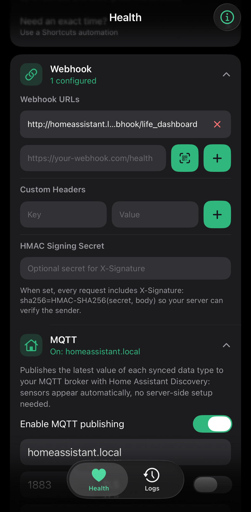
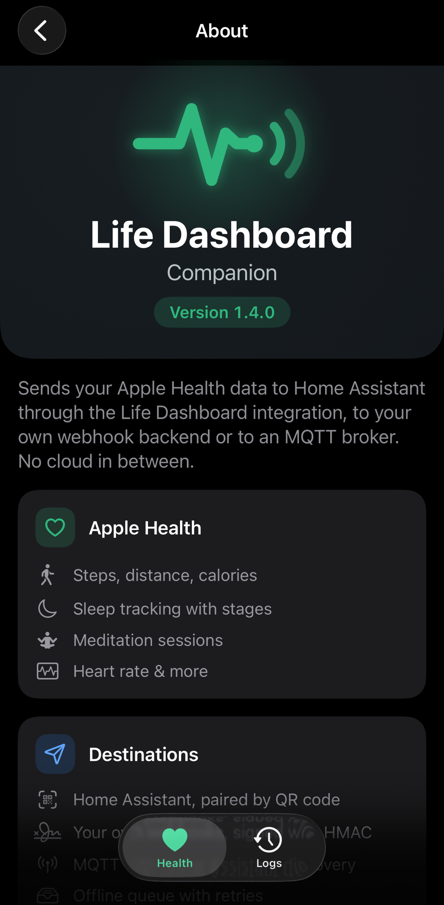

# Features

Everything Life Dashboard Companion for iOS does, in detail. For building and setup see [usage.md](usage.md); for the payload your server receives see [webhook.md](webhook.md).

## Apple Health

Reads Apple Health (HealthKit) and sends it to your webhooks, the Home Assistant integration or MQTT. Every type starts off, has its own toggle, and iOS asks for access to it the first time you switch it on.

### 28 supported data types

| Category | Types |
|---|---|
| Activity | Steps, Distance, Active Calories, Total Calories, Exercise Sessions |
| Body | Weight, Height, Body Temperature |
| Body composition | Body Fat, Lean Body Mass |
| Vitals | Heart Rate, Resting Heart Rate, Heart Rate Variability, Blood Pressure, Blood Glucose, Oxygen Saturation, Respiratory Rate, VO2 Max |
| Sleep | Sleep sessions with stages |
| Nutrition | Hydration, Nutrition (per food: energy, protein, carbohydrates, fat and 34 more nutrients) |
| Mindfulness | Mindful sessions, from apps that write them to Apple Health |
| Cycle tracking | Menstruation (flow, plus periods derived from it), Basal Body Temperature, Intermenstrual Bleeding, Ovulation Test, Cervical Mucus, Sexual Activity |

These are the Apple Health types that have a counterpart in the Android app, under the Android app's payload keys. Menstruation sends both flow and periods, so the 28 toggles cover 29 of the Android app's 33 types. The four that stay out (bone mass, body water mass, skin temperature and basal metabolic rate) have no Apple Health type that means the same; [webhook.md](webhook.md#what-ios-sends) says why for each.

- **Incremental sync** - each sync sends the records added since the last one, per type, from HealthKit's own change tracking, also when they are dated in the past. **Sync Now** sends the last 7 days again, up to the limits below, oldest first, and publishes the newest value of each type to MQTT
- **Bounded payloads** - at most 1000 records per sync for heart rate, steps and total calories, 500 for HRV and respiratory rate, and 200 for the rest. The next sync continues where this one stopped
- **Fault isolation** - a type that cannot be read is skipped, and the rest of the sync goes ahead. When no type answers at all, the sync fails with a row in the Logs tab instead of reporting no new data, as in the Android app
- **Daily totals** - per-day steps, distance and calories as the Health app counts them, with overlapping iPhone and Watch data counted once, in the Android app's `daily_totals` format. **Daily totals in payload** under Advanced switches it off
- **Deleted records** - a record deleted in Apple Health is named in `deleted_records`, so a receiver can drop it. See [webhook.md](webhook.md#deletions)

## History

- **Backfill** on the Health tab sends the last 30, 90 or 365 days of every enabled type to your webhooks, in 3-day windows, oldest first, with the Android app's backfill fields
- Progress is kept per window: **Pause** stops after the window in flight, and **Resume** continues at the first window that was not delivered in full
- It runs while the app is open and the iPhone is unlocked, and keeps the screen on meanwhile. On iOS 26 it runs as a continued processing task instead, which keeps going when you switch apps and shows its progress in the system UI
- Backfill payloads go to webhooks only, never to MQTT or the retry queue

## Webhook configuration

- **Pairing by QR code** - the [Home Assistant integration](https://github.com/owen282000/life-dashboard-ha) (0.7.1 or newer) shows a code, and **Scan a pairing code** under the webhook fills in the address and the signing secret after one confirmation. See [Pairing by QR code](usage.md#pairing-by-qr-code)
- **Multiple webhook URLs** - send to several endpoints at once; a sync counts as delivered when one of them accepted it
- **Custom headers** - auth tokens, API keys or any other HTTP header, sent to the URLs you typed in and never to one that pairing added
- **HMAC payload signing** - an optional `X-Signature` header, the Android app's scheme, so your server can verify the sender
- **Test ping** - send a small test payload to check your server without waiting for real data
- **Retries with backoff** - transient failures are retried; permanent errors fail at once
- **Retry queue** - every payload is queued on the phone before it is sent, so a sync that iOS cuts off loses nothing. One that was not delivered is sent again when the network comes back, at the next sync, or with **Retry Now**, to the URLs and with the headers configured at that moment. A payload the receiver refuses (HTTP 400, 413 or 422) does not hold up the ones after it. A payload older than 7 days is dropped when its next delivery fails, with a row in the Logs tab and a notification
- **HTTPS, and plain HTTP on the home network** - iOS allows `http://` only to an IP address, a `.local` name or a name without a dot

Delivery details, retry rules and signature verification are in [webhook.md](webhook.md#delivery-retries-and-signing).

## Home Assistant and MQTT

Two ways in. The [Life Dashboard integration](https://github.com/owen282000/life-dashboard-ha) takes the webhook directly and keeps the history in long-term statistics; [usage.md](usage.md#phone-to-home-assistant) explains how to set it up.

MQTT is the other way, for a setup that already runs a broker:

- **Home Assistant Discovery** - the app publishes a sensor per synced type, grouped under one device, with no YAML
- **21 sensors for 20 of the 28 types** - Steps Today, Distance Today, Active Calories Today and Total Calories Today, and the latest heart rate, resting heart rate, HRV, last sleep duration, weight, height, blood glucose, oxygen saturation, body temperature, basal body temperature, respiratory rate, body fat, lean body mass, VO2 max, blood pressure (systolic and diastolic) and hydration
- **Today's totals** - the four day sensors hold today's total as the Health app counts it, with iPhone and Watch counted once, under the Android app's names and units, with state class `total_increasing` and the day in a `date` attribute. They come from today's `daily_totals` entry, read for MQTT even when **Daily totals in payload** is off. Hydration holds the newest record, and its name says "(latest record)", as on Android
- **Retired sensors** - versions up to 1.4.1 published steps, distance and calories as "(latest record)" sensors; every publish now removes them from the broker, and with them from Home Assistant
- **Webhook only** - exercise, nutrition, mindfulness and the cycle tracking types are events rather than values, and a retained topic is no place for reproductive data
- **A destination of its own** - a broker without a webhook URL is enough, as in the Android app. **Sync Now**, the automatic syncs and the **Sync Health Data** action all publish, and the observers and background tasks start as soon as a broker is set, without reopening the app
- **Every sync with new records publishes** today's totals and the latest value of each type that has new records. A type that is still catching up past the per-sync cap is left out until it has caught up, and so is a type whose new records are all older than its newest one, such as a weight entered for last week, since neither holds the current value. Sync Now reads a type with more records in the week than its cap again from the newest end
- **No queue, no deletions, no backfill** - MQTT has no retry queue, and deleted records and backfill payloads go to webhooks only. A webhook URL added after a time with only a broker gets what is new from then on; **Sync Now** or **Backfill** sends what came before
- States and discovery configs are published retained; TLS and a username and password are optional, and the password is kept in the Keychain
- Its own device id and base topic (`lifedashboard-ios`), so an iPhone never collides with the Android app's sensors in the same household
- **Phone name** - for a second iPhone on the same broker, as in the Android app. Without a name the device and topics stay as they are; a name gives this iPhone its own device (`life_dashboard_companion_ios_<name>`) and topics (`lifedashboard-ios/<name>/<sensor>/state`). After a rename the next publish removes the old device's retained topics from the broker
- A built-in MQTT 3.1.1 client on Network.framework, so the app has no third-party dependencies

## Sync scheduling

- **Two modes** - an interval (at least 15 minutes, 60 by default) or a list of times of day, stored in the Android app's format
- **A time means "not before"** - iOS decides when an app runs in the background, so a fixed time syncs once, at the first chance iOS gives after it. A time missed until quiet hours, or on a day that is off, is skipped rather than moved
- **Weekday filter** - any subset of days
- **Quiet hours** - never sync between two times; queued payloads wait too
- The screen warns when a combination never syncs, and a line under **Sync Now** says why automatic syncs are waiting
- **Need an exact time?** - a Shortcuts Time of Day automation runs **Sync Health Data** at the minute you set; the app explains how
- **Sync Now** and the Shortcuts action ignore the schedule
- Schedules travel with the settings backup

## Background sync

Each of these is a chance to sync. It asks the schedule first, and syncs only when one is due:

1. **HealthKit background delivery** - HealthKit wakes the app when an enabled type has new data. Apple limits how often: step count, for example, at most once an hour
2. **App refresh task** - iOS runs it at a moment of its own choosing after the next scheduled sync
3. **Processing task** - the same, when the iPhone is idle
4. **Opening the app and unlocking the iPhone**

Each sends only what is new. Health data cannot be read while the iPhone is locked, so a sync that iOS starts then waits for the unlock.

## Automation

- **Shortcuts and Siri** - a **Sync Health Data** action, for a Shortcuts automation at a set time, on arriving home, or by voice. It sends what is queued and what is new, to the webhooks and the MQTT broker
- **Home screen widget** - the last sync result, records delivered today, and a status mark, so a failing background sync shows. Its button syncs now
- **Control Center** - on iOS 18 and later, a **Sync Now** control for Control Center, the Android app's Quick Settings tile. It needs an unlocked iPhone, as every sync does
- The widget button, the control and the Shortcuts action run **Sync Health Data**, and together sync at most once a minute, like the Android app's sync broadcast: a tap within a minute of the last accepted one does nothing
- **Failure notifications** - a local notification after a number of failed syncs in a row, which you choose

## Data tools

- **View** - the exact JSON payload before it is sent, with a share button for the full text
- **Export** - what View shows, as a JSON file or as CSV with a row per record and a column per field, through the share sheet. The file is written to the app's temporary folder, which is not backed up, and only the newest export is kept there
- **Logs** - every webhook delivery and MQTT publish with its status, error and payload, the last 100 entries
- **Sync history** - on the Logs tab: success rate, deliveries and records, the last success, and the three latest failures grouped by receiver and error. A delivery that iOS cut off, as when it ends a background task, shows as Interrupted and counts as neither a success nor a failure; its payload is queued for retry like a failed one
- **Export logs** - the log as CSV or JSON, through the share sheet
- **Settings backup and restore** - under About, the webhooks, headers, signing secret, schedule, MQTT settings and toggles as a JSON file, in the Android app's format, so a file moves between an iPhone and an Android phone. See [settings-backup.md](settings-backup.md)

## General

- **First-run setup** - what the app does, where the data goes (the pairing scanner, a webhook or an MQTT broker), which types, and Apple Health access. Every step can be skipped
- **About** - behind the (i) button on the Health and Logs tabs: what the app reads and where it goes, the privacy policy, settings backup, and links to the documentation, the changelog and issues
- **Privacy policy in the app** - the same text as [Privacy](../README.md#privacy) in the README
- **Languages** - English, Dutch and German, following the iPhone's language or the one set for the app under Settings. See [localization.md](localization.md)
- **SwiftUI** - the Android app's look, with Dynamic Type and dark mode
- **No third-party dependencies** - only Apple's frameworks

## What iOS does differently

The payload is the Android app's, but an iPhone is not an Android phone. Where iOS cannot do something, this says so; where the app simply does not do it, it says that instead.

- **No Screen Time.** iOS cannot send it anywhere. Apple's Screen Time API only shows usage inside a device activity report extension, which runs in a sandbox that cannot make network requests or move data out (Apple, [DeviceActivityReport](https://developer.apple.com/documentation/deviceactivity/deviceactivityreport)). There is no Screen Time tab and no `screen_time` payload.
- **iOS decides when the app runs.** No iOS app can run at a chosen minute in the background. HealthKit wakes the app on new data, with a minimum interval per type, and iOS runs background tasks when it sees fit. Background App Refresh does not run in Low Power Mode or when it is switched off for the app. A fixed time is "not before"; for an exact time, use a Shortcuts automation.
- **A locked iPhone cannot be read.** iOS encrypts Apple Health while the iPhone is locked (Apple, [Protecting user privacy](https://developer.apple.com/documentation/healthkit/protecting-user-privacy)). A sync that starts then waits for the unlock, and a backfill pauses.
- **No writing into Apple Health.** The app asks for read access only, so the Android app's receiving from Home Assistant (a scale or blood pressure monitor written into Health Connect) is not built on iOS.
- **Record source.** `source` is the name HealthKit gives the writing app or device, not a package name.
- **No data resolution, no diagnostics.** The Android app's per-type averaging (`_resolutions`) and its `_diagnostics` block are not built on iOS. See [what iOS does not send](webhook.md#what-ios-does-not-send).
- **MQTT** publishes the types a sync carries, where the Android app publishes every sensor it has published before, so a new broker sees the whole device at once. On the iPhone a new broker gets each sensor with the next record of its type; **Sync Now** sends them all.
- **No App Store or TestFlight build.** You build the app with Xcode; see [usage.md](usage.md#build-and-install).

## Tech stack

- **Swift and SwiftUI** - iOS 17 or later
- **HealthKit** - anchored queries, statistics queries and background delivery
- **BackgroundTasks** - app refresh, processing and, on iOS 26, continued processing tasks
- **URLSession** - webhook delivery with retries
- **Network framework** - the MQTT client and connectivity monitoring
- **App Intents and WidgetKit** - the Shortcuts action, the home screen widget and the Control Center control
- **CryptoKit and CommonCrypto** - HMAC signing and the encrypted settings backup
- **AVFoundation** - the pairing code scanner
